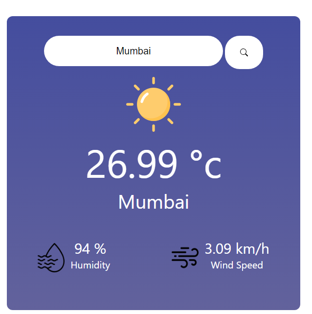

###Weather App
Overview
This Weather App is a simple web application built using React.js and HTML5. It allows users to retrieve weather information for a specific city by entering its name in the search bar. The app provides real-time data for temperature, humidity, and wind conditions.

#Features
City Search: Users can easily search for a city by name in the search bar to retrieve weather information.

Real-Time Weather Data: The app fetches up-to-date weather data, including temperature, humidity, and wind speed, from a reliable data source.

User-Friendly Interface: The user interface is intuitive and straightforward, making it easy for users to access weather information.

#Prerequisites
Before running the Weather App locally, ensure you have the following installed:

Node.js and npm (Node Package Manager): You can download and install them from the official website.
Getting Started
Clone the repository to your local machine:

bash
Copy code
git clone https://github.com/your-username/weather-app.git
Navigate to the project directory:

bash
Copy code
cd weather-app
Install the project dependencies:

bash
Copy code
npm install
Start the development server:

bash
Copy code
npm start
Open your web browser and go to http://localhost:3000 to use the Weather App.

#Usage
Launch the Weather App using the steps mentioned in the "Getting Started" section.

On the home page, you'll find a search bar.

Enter the name of the city for which you want to retrieve weather information and press the "Search" button or hit "Enter."

The app will display real-time weather data for the specified city, including temperature, humidity, and wind speed.

#Contributing
Contributions to this project are welcome. Feel free to open issues or pull requests to suggest improvements or report bugs.

License
This project is licensed under the MIT License - see the LICENSE file for details.

#Acknowledgments
Weather data is provided by OpenWeather.
Thank you for using the Weather App! We hope it helps you stay informed about the weather conditions in your favorite cities.

